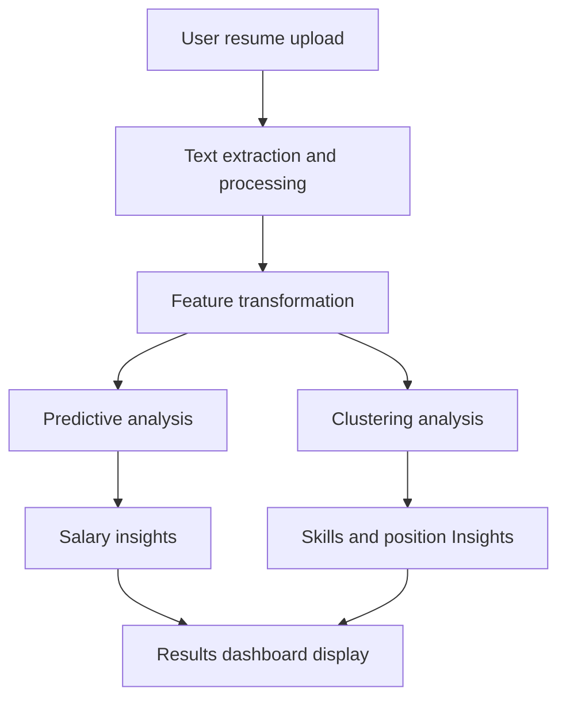
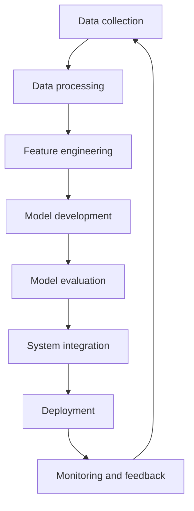

# ML System Design Document: Resume-Based Salary Prediction System

## 1. Project Motivation
The salary prediction system aims to provide jobseekers with accurate salary expectations based on their resumes, helping them make informed career decisions and negotiate better compensation packages. This addresses the common challenge of salary opacity in the job market and empowers users with data-driven insights about their market value.

## 2. Business Requirements and Constraints

### 2.1 Business Requirements
- Provide accurate salary predictions to ensure reliability for job seekers
- Generate interactive visualizations showing the user's position in the job market landscape
- Process and analyze resumes in real-time (response time < 30 seconds)
- Handle both Russian and English language resumes
- Support resume uploads in PDF format

### 2.2 Business Constraints
- Must comply with Russian personal data protection laws
- Maximum processing cost per resume should not exceed $0.01
- System should handle up to 1000 concurrent users
- Must maintain user privacy and data confidentiality

## 3. Project Scope

### 3.1 In Scope
- Resume text extraction and processing pipeline
- Salary prediction and job market insights
- Segmentation of users based on skills and positions
- MVP implementation with web interface
- Basic error handling and input validation
- Model monitoring and retraining pipeline

### 3.2 Out of Scope
- Integration with external job boards
- Salary negotiation recommendations
- Career path suggestions
- Resume improvement recommendations
- Other services (mobile app, telegram bot, etc.)

## 4. Solution Prerequisites
- Historical salary data (minimum 1000 records)
- Tools for text analysis and embedding generation for multi-language support
- Computing resources for model training and inference
- Storage infrastructure for user data and model artifacts

## 5. Task Definition

### 5.1 Machine Learning Tasks
1. **Regression Task**
   - Input: Extracted resume text features and relevant embeddings
   - Output: Predicted salary range
   - Success criteria: To be determined based on data analysis and business requirements

2. **Clustering Task**
   - Input: Processed position and skills data
   - Output: Segmented groups representing job market clusters
   - Success criteria: To be determined based on data analysis and business requirements

### 5.2 Technical Requirements
- Model inference time: < 30 seconds
- API response time: < 10 seconds
- System uptime: 99.9%
- Maximum file size for uploads: 100MB

## 6. Solution Architecture
### System Overview
The whole system consists of the following components

1. **Frontend Layer**

   A web-based interface for user interactions (e.g., resume uploads, results display, and feedback collection).

2. **Processing Layer**

   Methods for transforming resume data (after text extraction and preprocessing) into usable features for downstream tasks.

3. **Model Layer**
   - Predictive models for salary
   - Analytical processes for skills and position clustering
   - Model registry for managing versions and monitoring performance.

4. **Data Layer**
   - Storage for resumes, historical salary data, and user feedback.
   - Management of processed outputs and model artifacts.

### Conceptual Data Flow
1. The user uploads a resume through the web interface.
2. The system extracts and preprocesses relevant information from the resume (e.g., skills, experience, and education).
3. Embedding methods are applied to transform extracted features into numerical representations.
4. Predictive and clustering methods are applied to generate salary insights and find corresponing cluster for the user in the job market.
5. Results are displayed through interactive dashboards.

### Model training pipeline:
