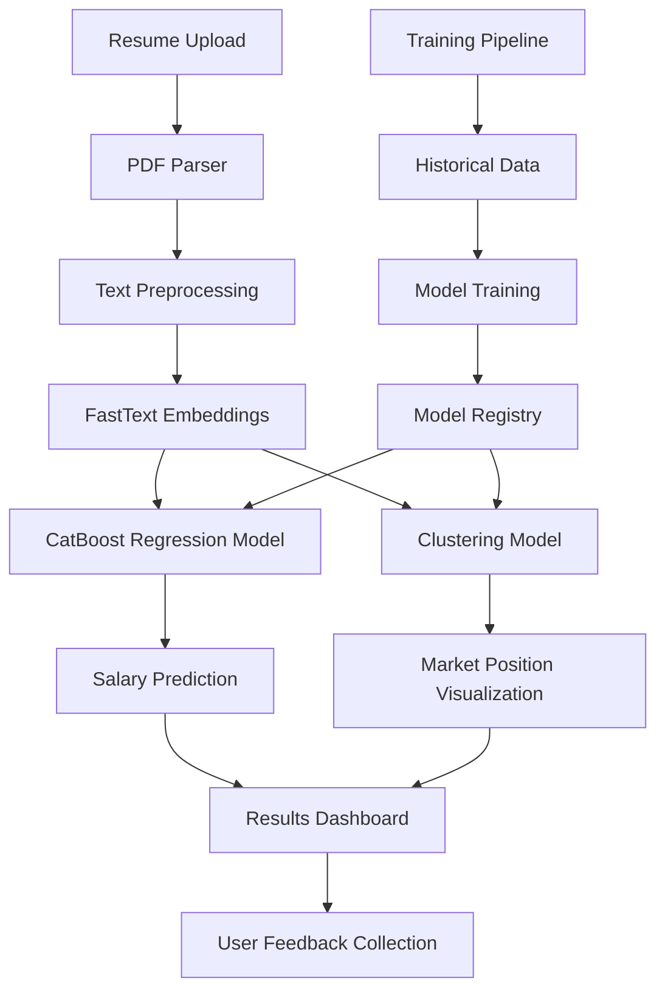

# ML System Design Document: Resume-Based Salary Prediction System

## 1. Project Motivation
The salary prediction system aims to provide jobseekers with accurate salary expectations based on their resumes, helping them make informed career decisions and negotiate better compensation packages. This addresses the common challenge of salary opacity in the job market and empowers users with data-driven insights about their market value.

## 2. Business Requirements and Constraints

### 2.1 Business Requirements
- Provide accurate salary predictions with a maximum error margin of ±15% to ensure reliability
- Generate interactive visualizations showing the user's position in the job market landscape
- Process and analyze resumes in real-time (response time < 30 seconds)
- Handle both Russian and English language resumes
- Support pdf for resume uploads

### 2.2 Business Constraints
- Must comply with Russian personal data protection laws
- Maximum processing cost per resume should not exceed $0.01
- System should handle up to 1000 concurrent users
- Must maintain user privacy and data confidentiality

## 3. Project Scope

### 3.1 In Scope
- Resume text extraction and processing pipeline
- Salary prediction model using CatBoost
- Skills and position clustering
- Streamlit-based web interface
- Basic error handling and input validation
- Model monitoring and retraining pipeline

### 3.2 Out of Scope
- Integration with external job boards
- Salary negotiation recommendations
- Career path suggestions
- Resume improvement recommendations
- Other services (mobile app, telegram bot, etc.)

## 4. Solution Prerequisites
- Historical salary data (minimum 1000 records)
- Pre-trained FastText model for Russian language
- Computing resources for model training and inference
- Storage infrastructure for user data and model artifacts

## 5. Task Definition

### 5.1 Machine Learning Tasks
1. Regression Task:
   - Input: Resume text features and FastText embeddings
   - Output: Predicted salary range
   - Metric: MAE (Mean Absolute Error) < 15000

2. Clustering Task:
   - Input: Position and skills embeddings
   - Output: Job market segments visualization
   - Metric: Silhouette score > 0.6

### 5.2 Technical Requirements
- Model inference time: < 30 seconds
- API response time: < 10 seconds
- System uptime: 99.9%
- Maximum file size: 100MB

## 6. Solution Architecture

### Components Description:
1. Frontend Layer:
   - Streamlit web interface
   - Resume upload functionality
   - Interactive visualization dashboard
   - Error handling and user feedback collection

2. Processing Layer:
   - Resume parsing service
   - Text preprocessing pipeline
   - FastText embedding generation
   - Model inference service

3. Model Layer:
   - CatBoost regression model
   - Clustering model
   - Model registry and versioning
   - Model monitoring and retraining pipeline

4. Data Layer:
   - Resume storage
   - Historical salary data
   - Model artifacts storage
   - User feedback database

### Data Flow:
1. User uploads resume through Streamlit interface
2. Resume is parsed and preprocessed
3. FastText embeddings are generated
4. Salary prediction and clustering models process the embeddings
5. Results are displayed in interactive dashboard
6. User feedback is collected for model improvement